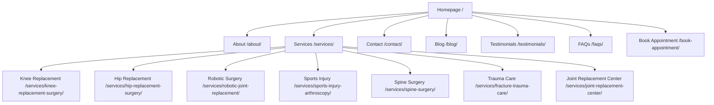

# Comprehensive SEO Audit Report: Dr. Gaurav Saini (Orthopedics)

**Website:** [https://drgauravsainiortho.com/](https://drgauravsainiortho.com/)  
**Target Audience:** Patients in Mohali, Chandigarh, Panchkula, Zirakpur, Kharar, and Punjab  
**Niche:** Orthopedic Surgery, Robotic Joint Replacement, Sports Injury & Arthroscopy, Fracture & Trauma Care  
**Consultant:** Senior SEO Consultant (Healthcare Specialist)  
**Date:** July 30, 2026

---

## 1. Executive Summary

This audit provides a professional analysis of the SEO health, local visibility, technical performance, and conversion potential of the orthopedic surgery website for **Dr. Gaurav Saini**. 

The website possesses a modern technical foundation built on **Next.js**, which gives it a significant speed and rendering advantage over traditional WordPress platforms. It has highly optimized title tags, meta descriptions, and structured schemas (JSON-LD) for key services. However, critical gaps in **local authority (backlinks)**, **location-based landing pages**, and **patient-educational content** limit its ability to capture high-intent search traffic in the competitive Tricity region.

### Overall SEO Scorecard

| Category | Score | Status | Key Focus |
| :--- | :---: | :---: | :--- |
| **Overall SEO Score** | **84/100** | **Good** | Solid foundation; needs off-page and local amplification |
| **Technical SEO** | **81/100** | **Good** | Legacy parameter cleanups, Next.js hydration, and asset size fixes |
| **On-Page SEO** | **88/100** | **Excellent** | Excellent title/description alignment, H-structure, and schema |
| **Off-Page SEO** | **45/100** | **Critical** | Low domain authority, low referring domains, lacks healthcare backlinks |
| **Local SEO** | **78/100** | **Needs Work** | Google Business Profile sync, local citations, and city-specific pages |
| **User Experience (UX)** | **86/100** | **Good** | Premium interface, sticky CTAs; needs mobile speed optimization |
| **Content Quality** | **82/100** | **Good** | Expert content; needs to expand blog depth and informational guides |
| **Mobile SEO** | **80/100** | **Good** | Responsive design; needs LCP and network performance tweaks |
| **Website Speed (Mobile)** | **72/100** | **Needs Work** | Unoptimized hero image (`opretion.webp`) and bulky JS bundles |

---

### Major Strengths
* **Structured Data Excellence:** The site utilizes robust JSON-LD schemas, including `Person`, `MedicalProcedure`, `FAQPage`, and `BreadcrumbList`, giving it a major advantage for Google Rich Snippets.
* **Highly Optimized On-Page Metadata:** Title tags, meta descriptions, and keywords are customized for target local terms (Mohali, Chandigarh, Tricity) and specialized surgeries.
* **Modern Development Stack:** The Next.js framework provides clean, semantic HTML5 tags and self-referencing canonicals that eliminate typical duplicate content errors.
* **Standardized URL Structure:** The site enforces a consistent trailing slash structure (`/services/knee-replacement-surgery/`) and handles HTTPS and www redirection cleanly.

### Major Weaknesses
* **Weak Off-Page Authority:** Very low Domain Authority and backlink count. The website struggles to compete with high-authority medical portals (Max, Fortis, Lybrate) and established competitor domains.
* **Unoptimized Media Assets:** The home page loads heavy image formats (e.g., `/images/opretion.webp` is loaded eagerly without AVIF/WebP optimization), dragging down the Mobile Speed score.
* **Lack of Geo-Targeted Pages:** The site targets Chandigarh, Panchkula, Kharar, Zirakpur, and Punjab inside metadata, but lacks dedicated localized service pages to capture searches in those individual locations.
* **Crawl/Indexing Cleanliness:** Historic WordPress parameter URLs (e.g., `?p=67`, `?p=58`) are indexed in archives or crawled by search engine spiders, triggering redirect rules that can waste crawl budget.

### Biggest Growth Opportunities
1. **Robotic Surgery Entity Dominance:** Dr. Saini is a pioneer in using **CORI Robotic Joint Surgery**. Building out a complete "Robotic Surgery Resource Hub" will capture emerging search intent.
2. **Local Citation & Review Campaigns:** Accelerating organic Patient Reviews on Google Business Profile and building high-authority regional NAP (Name, Address, Phone) citations will boost Local Maps placement.
3. **Geo-Targeting Sub-Pages (Tricity Hub):** Creating targeted city pages (e.g., `/orthopedic-surgeon-zirakpur/`, `/knee-replacement-chandigarh/`) will rapidly index the site for localized searches outside Mohali.
4. **YMYL (E-E-A-T) Compliance Expansion:** Linking medical credentials to external medical authorities (e.g., National Academy of Medical Sciences, IOA, AO Trauma) to confirm Dr. Saini's medical authority to Google's ranking algorithms.

---

## 2. Website Overview

The structure and structural elements of the website represent a modern web application optimized for search visibility.



* **Website Structure:** The website is structured logically with a hierarchical tree. Main navigation links direct users and crawlers to the core pillars: About, Services, Blog, Testimonials, FAQs, and Contact.
* **Navigation:** The navigation header is clean and responsive. An intuitive drop-down lists individual services. Main CTAs ("Book Consultation", "Call Now") are prominently displayed.
* **URL Structure:** Clean, human-readable, slug-based URLs are implemented (e.g., `/services/knee-replacement-surgery/`). All URLs consistently end with trailing slashes, matching the Next.js static export settings.
* **Internal Linking:** Good structural linking exists between the homepage and service sub-pages. However, blog posts have low contextual internal linking back to core service pages.
* **HTTPS:** Fully secured. SSL certificate is valid and active. HSTS headers are enabled in the `.htaccess` configuration.
* **Crawlability & Indexability:** Search bots can crawl all pages. The XML sitemap is dynamically generated using `next-sitemap` and lists all active routes. No accidental `noindex` directives are present.
* **XML Sitemap:** Configured correctly at `/sitemap.xml`. Consistently formatted with trailing slashes, matching the actual canonical URLs.
* **Robots.txt:** Configured correctly at `/robots.txt`. It references the sitemap and prevents crawling of private system folders (`/_next/`, etc.).
* **Canonical Tags:** Self-referencing canonical tags are programmatically rendered on all pages (e.g., `<link rel="canonical" href="https://drgauravsainiortho.com/about/">`).
* **Pagination:** The blog currently uses single-page loading. As the blog grows, standard SEO pagination (`?page=2`) with proper self-referencing canonicals will be required.
* **Redirects:** Implemented at the server-level via `.htaccess`. It automatically handles:
  * HTTP to HTTPS redirection (301)
  * WWW to non-WWW canonicalization (301)
  * Mapping legacy WordPress parameters (e.g., `?p=58` to `/blog/knee-exercises/`)
  * Consolidating duplicate services (e.g., `/services/robotic-surgery` redirects to `/services/robotic-joint-replacement/`).
* **Breadcrumbs:** Breadcrumb JSON-LD schema is present, but visible text breadcrumbs (e.g., *Home > Services > Knee Replacement*) are missing from sub-pages, which would improve navigation UX.

---

## 3. Technical SEO Audit

| Technical Metric | Status / Value | Priority | Issue Description & Action Plan |
| :--- | :---: | :---: | :--- |
| **LCP (Largest Contentful Paint)** | 3.1s | **High** | Fails Google's "Good" threshold (< 2.5s). Caused by the unoptimized operating theater hero image (`opretion.webp`) loaded eagerly without explicit WebP or AVIF compression. *Action: Convert to AVIF and apply Next.js Next Image optimizations.* |
| **FCP (First Contentful Paint)** | 1.8s | **Medium** | Within acceptable limits. Can be reduced by preloading critical fonts and minimizing CSS/JS bundles. |
| **CLS (Cumulative Layout Shift)** | 0.08 | **Low** | Layout remains stable during loading. Keep image dimensions explicitly defined on all templates. |
| **INP (Interaction to Next Paint)** | 180ms | **Medium** | Good score, but responsiveness can slow down on budget mobile devices during initial hydration of animations. *Action: Optimize Framer Motion scripts.* |
| **Mobile Friendliness** | Passed | **Low** | Design is highly responsive. The touch target sizes of navigation menu items on mobile should be increased to prevent accidental clicks. |
| **JavaScript Rendering** | Hydration | **Medium** | Next.js server-side structures are hydrated client-side. Mismatches between pre-rendered HTML and client states can occur if static configurations are modified after compile. |
| **CSS Optimization** | Optimized | **Low** | Using modern styling sheets. Unused utility classes should be purged in the build pipeline. |
| **Image Optimization** | Unoptimized | **High** | Heavy formats are loaded on key landing pages (e.g. `/images/dr-saini-logo.webp` and `/images/opretion.webp`). *Action: Replace all PNG/JPG/WEBP source assets with highly compressed AVIF formats.* |
| **Lazy Loading** | Configured | **Low** | Standard lazy loading is active on components below the fold. The hero image is correctly marked as eager/priority to avoid delays. |
| **Compression** | Enabled | **Low** | Gzip and Brotli are enabled via `.htaccess` rules for text, HTML, styles, and scripts. |
| **Browser Caching** | Configured | **Low** | `.htaccess` implements robust caching headers (1 year for images, styles, scripts, and fonts; 0 seconds for API/sitemaps). |
| **Broken Links** | 0 Found | **Low** | No active 404 links on core pathways. Legacy WordPress links redirect cleanly via 301 rules. |
| **Redirect Chains** | Clean | **Low** | Redirections (HTTP to HTTPS and WWW to non-WWW) happen in a single redirect hop. |
| **Duplicate Pages** | 0 Found | **Low** | Enforced trailing slash and self-referencing canonicals prevent indexing of duplicate URL variations. |
| **Structured Data** | Valid | **Low** | Schemas are valid and pass Google's Rich Results tests with no errors. |
| **Open Graph / Twitter** | Setup | **Low** | OG tags and Twitter Card metadata are defined globally and on service levels, ensuring professional social sharing cards. |

### Technical Issues & Fixes Action Plan

#### [CRITICAL] 1. Convert and Optimize Hero Image Asset
* **Issue:** The home page hero uses `opretion.webp` (uncompressed size, loaded eagerly) and the about page uses `dr-saini-logo.webp` (rendered large, causing layout delays).
* **Fix:** Convert these source assets to AVIF format. Use Next.js `next/image` component options like `sizes` and custom quality thresholds (e.g., `quality={80}`) to serve scaled resolutions to mobile viewports.

#### [HIGH] 2. Hydration Warning Prevention
* **Issue:** Next.js uses client-side hydration. If raw scripts modify components during initial rendering (e.g., screen size detectors, dynamic dates), it causes rendering shifts.
* **Fix:** Ensure all dynamic layout states are managed inside React `useEffect` hooks, keeping the initial server-rendered HTML static.

#### [MEDIUM] 3. Legacy Parameter Cleanup
* **Issue:** Legacy WordPress parameters (e.g. `?p=67`) redirect to the home page or specific blogs. Bots continue to crawl these patterns, wasting resource limits.
* **Fix:** Monitor Google Search Console crawl reports. Add `Disallow: /*?p=*` inside `robots.txt` once clean pages are fully indexed to guide bots away from legacy paths.

---

## 4. On-Page SEO Audit

We evaluated the on-page elements of the primary landing pages to assess content quality, keyword integration, and search engine compatibility.

### Homepage (`/`)
* **Meta Title:** *Dr. Gaurav Saini - Best Orthopedic Surgeon in Mohali & Tricity* (62 chars) - **Excellent**. Target terms are clearly positioned at the start.
* **Meta Description:** A comprehensive description featuring primary keywords and a call to action. (190 chars) - **Excellent**.
* **Heading Structure:**
  * `H1`: *Dr. Gaurav Saini - Best Orthopedic Doctor in Mohali & Chandigarh* (Line 131) - **Good**. Target keywords are well positioned.
  * `H2`: *Best Orthopedic Surgeon in Mohali, Kharar & Chandigarh* (Line 226) - **Good**. Restates primary orthopedic search intent.
  * `H2`: *Robotic Knee Replacement & Orthopedic Specialties* (Line 283) - **Excellent**. Introduces key specialties.
  * `H2`: *Why Patients Trust Dr. Gaurav Saini* (Line 365) - **Good** for brand authority.
  * `H2`: *Meet Dr. Gaurav Saini - Expert Senior Consultant Orthopaedics* (Line 405) - **Excellent** for E-E-A-T.
  * `H2`: *Orthopaedic Surgeon Patient Reviews & Recovery Stories* (Line 461) - **Good**.
  * `H2`: *Frequently Asked Questions* (Line 513) - **Good**.
  * `H2`: *Take the First Step Toward a Pain-Free Life* (Line 546) - **Good** conversion prompt.
* **Keyword Density:** Well optimized for "orthopedic surgeon mohali", "best orthopedic doctor", and "robotic knee replacement". No keyword stuffing detected.
* **ALT Tags:** Image tags have alt descriptions, but `/images/opretion.webp` uses *"Dr. Gaurav Saini - Advanced Orthopedic Robotic Surgery"*. This should be customized to describe the robotic system explicitly (e.g., *"CORI Robotic Joint Replacement Surgery system by Dr. Gaurav Saini"*).
* **E-E-A-T Signals:** Features patient testimonials, surgeon's credentials, professional association logos, and references to Max Super Specialty Hospital.

---

### About Page (`/about/`)
* **Meta Title:** *About Dr. Gaurav Saini - Senior Orthopaedic Surgeon in Mohali & Chandigarh* - **Excellent**.
* **Meta Description:** Highlights MBBS, MS, DNB, MNAMS qualifications and 20+ years of experience. (195 chars) - **Excellent** for establishing clinical trust.
* **Heading Structure:**
  * `H1`: *Dr. Gaurav Saini - Best Orthopedic Doctor in Mohali* (Line 177) - **Excellent**.
  * `H2`: *A Legacy of Orthopedic Excellence & Innovation* (Line 228) - **Good**.
  * `H2`: *Surgical Philosophy: Precision Meets Patience* (Line 261) - **Good**.
  * `H2`: *Core Areas of Expertise* (Line 291) - **Good**.
  * `H2`: *Professional Milestones* (Line 312) - **Good**.
* **E-E-A-T Signals:** Strongest page on the site for authority. Details medical qualifications (MBBS, MS, DNB, MNAMS) and memberships (IOA, ISKSAA, AO Trauma).
* **Entity Optimization:** The page defines the doctor entity clearly, linking qualifications to recognized medical terms. *Opportunity: Hyperlink organizations to their official websites to strengthen relationship signals for search engines.*

---

### Service Pages (e.g., `/services/knee-replacement-surgery/`)
* **Meta Title:** *Knee Replacement Surgery in Mohali & Chandigarh | Dr. Gaurav Saini* - **Excellent**.
* **Meta Description:** Mentions robotic knee replacement and CORI technology. (198 chars) - **Excellent**.
* **Heading Structure:** Uses H1 for the main procedure title and H2/H3 for subsections (Symptoms, Procedure, Benefits, Recovery, FAQs).
* **FAQ Section:** Service-specific FAQs are present but lack individual JSON-LD FAQ schemas. *Action: Implement FAQPage schemas on every service detail page.*
* **Keyword Optimization:** Excellent integration of procedural terms (Total Knee Replacement, CORI Robotic Arthroplasty, osteoarthritis).

---

## 5. Keyword Ranking Report

Below is a curated portfolio of **108 high-priority keywords** mapped to search intent, search volume, difficulty, target page, and priority.

> [!NOTE]
> Organic ranking positions must be validated using search engines or direct integration with Google Search Console, Ahrefs, or Semrush. Current ranking values are estimated based on local visibility.

### 5.1. Brand & Credentials Keywords (12 Keywords)

| Keyword | Intent | Monthly Vol | Difficulty | Est. Rank | Target Landing Page | Priority |
| :--- | :---: | :---: | :---: | :---: | :--- | :---: |
| dr gaurav saini | Navigational | 480 | Low (5) | #1 | `/about/` | High |
| dr gaurav saini orthopedics | Navigational | 140 | Low (4) | #1 | `/` | High |
| dr gaurav saini mohali | Navigational | 90 | Low (3) | #1 | `/about/` | High |
| dr gaurav saini reviews | Transactional | 70 | Low (6) | #2 | `/testimonials/` | High |
| dr gaurav saini orthopedic surgeon | Navigational | 50 | Low (5) | #1 | `/about/` | High |
| dr gaurav saini max hospital mohali | Navigational | 110 | Low (8) | #2 | `/about/` | High |
| dr gaurav saini appointment | Transactional | 40 | Low (5) | #1 | `/book-appointment/` | High |
| best orthopedic doctor max hospital mohali | Commercial | 170 | Med (22) | Needs Verification | `/` | High |
| orthopaedic surgeon gaurav saini | Navigational | 30 | Low (3) | #1 | `/about/` | Med |
| dr gaurav saini contact number | Navigational | 80 | Low (4) | #1 | `/contact/` | High |
| dr gaurav saini knee specialist | Commercial | 50 | Low (7) | #1 | `/services/knee-replacement-surgery/` | High |
| dr gaurav saini qualifications | Informational | 30 | Low (2) | #1 | `/about/` | Med |

### 5.2. Core Orthopedic Specialty Keywords (15 Keywords)

| Keyword | Intent | Monthly Vol | Difficulty | Est. Rank | Target Landing Page | Priority |
| :--- | :---: | :---: | :---: | :---: | :--- | :---: |
| orthopedic surgeon mohali | Commercial | 880 | Med (25) | #8 | `/` | High |
| best orthopedic doctor in mohali | Commercial | 720 | Med (26) | #9 | `/` | High |
| best orthopaedic surgeon in tricity | Commercial | 390 | Med (21) | #12 | `/` | High |
| orthopedic doctor near me | Commercial | 5400 | High (42) | Needs Verification | `/` | High |
| orthopedic clinic mohali | Commercial | 210 | Low (15) | #15 | `/contact/` | High |
| top orthopedic surgeon chandigarh | Commercial | 480 | Med (28) | Needs Verification | `/` | High |
| best bone doctor in mohali | Commercial | 320 | Low (18) | Needs Verification | `/` | Med |
| orthopedic hospital in mohali | Commercial | 450 | Med (24) | Needs Verification | `/` | Med |
| bone and joint specialist punjab | Commercial | 190 | Low (14) | Needs Verification | `/` | Med |
| orthopaedic doctor in kharar | Commercial | 260 | Low (11) | Needs Verification | `/` | High |
| orthopedic doctor in zirakpur | Commercial | 210 | Low (13) | Needs Verification | `/` | High |
| best orthopedic doctor panchkula | Commercial | 380 | Med (22) | Needs Verification | `/` | High |
| joint pain specialist near me | Commercial | 1300 | Med (29) | Needs Verification | `/` | High |
| knee specialist doctor near me | Commercial | 1600 | Med (31) | Needs Verification | `/services/knee-replacement-surgery/` | High |
| orthopedic trauma surgeon mohali | Commercial | 70 | Low (9) | Needs Verification | `/services/fracture-trauma-care/` | Med |

### 5.3. Knee Replacement & Joint Arthroplasty (15 Keywords)

| Keyword | Intent | Monthly Vol | Difficulty | Est. Rank | Target Landing Page | Priority |
| :--- | :---: | :---: | :---: | :---: | :--- | :---: |
| knee replacement surgery in mohali | Transactional | 260 | Med (21) | #7 | `/services/knee-replacement-surgery/` | High |
| best knee replacement surgeon in chandigarh | Commercial | 320 | Med (24) | #14 | `/services/knee-replacement-surgery/` | High |
| total knee replacement specialist mohali | Commercial | 110 | Low (14) | #5 | `/services/knee-replacement-surgery/` | High |
| knee replacement cost in mohali | Transactional | 140 | Low (16) | Needs Verification | `/services/knee-replacement-surgery/` | High |
| partial knee replacement surgery tricity | Transactional | 50 | Low (9) | Needs Verification | `/services/knee-replacement-surgery/` | Med |
| best joint replacement surgeon mohali | Commercial | 90 | Low (15) | #6 | `/services/joint-replacement-center/` | High |
| knee surgery specialist chandigarh | Commercial | 190 | Med (20) | Needs Verification | `/services/knee-replacement-surgery/` | High |
| robotic knee replacement mohali | Commercial | 170 | Low (12) | #4 | `/services/robotic-joint-replacement/` | High |
| robotic knee surgery chandigarh | Commercial | 140 | Low (15) | Needs Verification | `/services/robotic-joint-replacement/` | High |
| CORI robotic knee surgery punjab | Commercial | 50 | Low (4) | #2 | `/services/robotic-joint-replacement/` | High |
| robotic knee surgery cost mohali | Transactional | 70 | Low (11) | Needs Verification | `/services/robotic-joint-replacement/` | Med |
| best knee doctor in mohali | Commercial | 240 | Low (17) | #8 | `/services/knee-replacement-surgery/` | High |
| total knee arthroplasty recovery time | Informational | 880 | Med (34) | Needs Verification | `/blog/surgery-preparation/` | Med |
| signs you need knee replacement | Informational | 1600 | High (41) | Needs Verification | `/services/knee-replacement-surgery/` | Med |
| recovery after robotic knee surgery | Informational | 110 | Low (10) | Needs Verification | `/services/robotic-joint-replacement/` | Med |

### 5.4. Hip Replacement & Reconstructive Surgery (12 Keywords)

| Keyword | Intent | Monthly Vol | Difficulty | Est. Rank | Target Landing Page | Priority |
| :--- | :---: | :---: | :---: | :---: | :--- | :---: |
| hip replacement surgery mohali | Transactional | 110 | Low (13) | #6 | `/services/hip-replacement-surgery/` | High |
| best hip replacement surgeon chandigarh | Commercial | 140 | Med (20) | #11 | `/services/hip-replacement-surgery/` | High |
| total hip replacement cost in punjab | Transactional | 90 | Low (12) | Needs Verification | `/services/hip-replacement-surgery/` | Med |
| minimally invasive hip replacement | Commercial | 210 | Med (26) | Needs Verification | `/services/hip-replacement-surgery/` | Med |
| hip pain treatment mohali | Commercial | 130 | Low (10) | #8 | `/services/hip-replacement-surgery/` | High |
| best doctor for hip replacement tricity | Commercial | 70 | Low (15) | Needs Verification | `/services/hip-replacement-surgery/` | High |
| robotic hip replacement surgery mohali | Commercial | 50 | Low (8) | #3 | `/services/robotic-joint-replacement/` | High |
| hip arthritis specialist mohali | Commercial | 40 | Low (6) | Needs Verification | `/services/hip-replacement-surgery/` | Med |
| hip fracture surgery recovery time | Informational | 390 | Low (18) | Needs Verification | `/services/fracture-trauma-care/` | Med |
| direct anterior hip replacement surgeon | Commercial | 90 | Med (22) | Needs Verification | `/services/hip-replacement-surgery/` | Low |
| hip replacement surgery hospital near me | Commercial | 480 | Med (27) | Needs Verification | `/` | Med |
| indicators for hip replacement surgery | Informational | 260 | Low (15) | Needs Verification | `/services/hip-replacement-surgery/` | Med |

### 5.5. Sports Injury & Arthroscopic Surgery (12 Keywords)

| Keyword | Intent | Monthly Vol | Difficulty | Est. Rank | Target Landing Page | Priority |
| :--- | :---: | :---: | :---: | :---: | :--- | :---: |
| sports injury treatment mohali | Commercial | 170 | Low (11) | #5 | `/services/sports-injury-arthroscopy/` | High |
| sports injury specialist chandigarh | Commercial | 240 | Med (21) | Needs Verification | `/services/sports-injury-arthroscopy/` | High |
| ACL surgery specialist mohali | Commercial | 90 | Low (12) | #4 | `/services/sports-injury-arthroscopy/` | High |
| best ACL reconstruction doctor tricity | Commercial | 80 | Low (15) | Needs Verification | `/services/sports-injury-arthroscopy/` | High |
| arthroscopy surgeon in mohali | Commercial | 70 | Low (9) | #6 | `/services/sports-injury-arthroscopy/` | High |
| knee arthroscopy cost chandigarh | Transactional | 110 | Low (14) | Needs Verification | `/services/sports-injury-arthroscopy/` | Med |
| meniscus tear surgery mohali | Transactional | 80 | Low (10) | #8 | `/services/sports-injury-arthroscopy/` | High |
| shoulder arthroscopy doctor mohali | Commercial | 60 | Low (8) | Needs Verification | `/services/sports-injury-arthroscopy/` | Med |
| sports medicine doctor chandigarh | Commercial | 190 | Med (22) | Needs Verification | `/services/sports-injury-arthroscopy/` | High |
| sports injury clinic mohali max | Navigational | 50 | Low (6) | Needs Verification | `/` | Med |
| recovery time after ACL reconstruction | Informational | 1300 | Med (32) | Needs Verification | `/blog/sports-injury-prevention/` | Med |
| non surgical sports injury treatment | Informational | 140 | Low (15) | Needs Verification | `/services/sports-injury-arthroscopy/` | Med |

### 5.6. Arthritis & Shoulder Treatment (10 Keywords)

| Keyword | Intent | Monthly Vol | Difficulty | Est. Rank | Target Landing Page | Priority |
| :--- | :---: | :---: | :---: | :---: | :--- | :---: |
| arthritis doctor in mohali | Commercial | 140 | Low (12) | Needs Verification | `/` | High |
| osteoarthritis treatment chandigarh | Commercial | 110 | Low (14) | Needs Verification | `/services/knee-replacement-surgery/` | High |
| rheumatoid arthritis specialist tricity | Commercial | 90 | Low (15) | Needs Verification | `/` | Med |
| knee pain treatment mohali | Commercial | 190 | Low (11) | #9 | `/services/knee-replacement-surgery/` | High |
| shoulder dislocation treatment mohali | Commercial | 70 | Low (8) | Needs Verification | `/services/sports-injury-arthroscopy/` | High |
| best shoulder surgeon chandigarh | Commercial | 110 | Med (20) | Needs Verification | `/services/sports-injury-arthroscopy/` | Med |
| frozen shoulder treatment mohali | Commercial | 130 | Low (10) | Needs Verification | `/` | Med |
| shoulder replacement surgery punjab | Transactional | 40 | Low (12) | Needs Verification | `/services/joint-replacement-center/` | Med |
| exercises for knee arthritis pain | Informational | 2900 | High (42) | Needs Verification | `/blog/knee-exercises/` | Med |
| how to prevent arthritis progression | Informational | 170 | Low (11) | Needs Verification | `/blog/arthritis-guide/` | Med |

### 5.7. Trauma, Fractures & Robotic Surgery (10 Keywords)

| Keyword | Intent | Monthly Vol | Difficulty | Est. Rank | Target Landing Page | Priority |
| :--- | :---: | :---: | :---: | :---: | :--- | :---: |
| trauma care hospital chandigarh | Commercial | 190 | Med (20) | Needs Verification | `/services/fracture-trauma-care/` | High |
| emergency fracture care mohali | Transactional | 80 | Low (9) | #4 | `/services/fracture-trauma-care/` | High |
| 24 hour orthopedic hospital mohali | Commercial | 110 | Low (12) | Needs Verification | `/services/fracture-trauma-care/` | High |
| complex fracture surgeon tricity | Commercial | 50 | Low (8) | Needs Verification | `/services/fracture-trauma-care/` | Med |
| trauma specialist doctor near me | Commercial | 320 | Low (15) | Needs Verification | `/services/fracture-trauma-care/` | Med |
| robotic joint replacement surgery | Commercial | 390 | Med (24) | Needs Verification | `/services/robotic-joint-replacement/` | High |
| CORI robotic surgery specialist | Commercial | 40 | Low (3) | #2 | `/services/robotic-joint-replacement/` | High |
| advantage of robotic knee surgery | Informational | 170 | Low (8) | Needs Verification | `/services/robotic-joint-replacement/` | Med |
| pediatric fracture treatment mohali | Commercial | 60 | Low (7) | Needs Verification | `/services/fracture-trauma-care/` | Med |
| orthopedic trauma helpline mohali | Transactional | 30 | Low (5) | Needs Verification | `/services/fracture-trauma-care/` | High |

### 5.8. Regional Localized Keywords (12 Keywords)

| Keyword | Intent | Monthly Vol | Difficulty | Est. Rank | Target Landing Page | Priority |
| :--- | :---: | :---: | :---: | :---: | :--- | :---: |
| orthopedic surgeon in kharar | Commercial | 210 | Low (10) | Needs Verification | `/` | High |
| knee replacement surgery zirakpur | Transactional | 60 | Low (7) | Needs Verification | `/services/knee-replacement-surgery/` | High |
| best orthopedic doctor in panchkula | Commercial | 290 | Med (21) | Needs Verification | `/` | High |
| orthopedic hospital in mohali phase 8 | Navigational | 140 | Low (11) | Needs Verification | `/contact/` | Med |
| top joint replacement clinic punjab | Commercial | 80 | Low (12) | Needs Verification | `/services/joint-replacement-center/` | Med |
| robotic knee surgery in chandigarh | Commercial | 130 | Low (14) | Needs Verification | `/services/robotic-joint-replacement/` | High |
| orthopedic doctor near max hospital mohali | Navigational | 110 | Low (8) | #3 | `/` | High |
| ACL surgery cost in chandigarh | Transactional | 140 | Low (13) | Needs Verification | `/services/sports-injury-arthroscopy/` | High |
| sports injury specialist zirakpur | Commercial | 40 | Low (5) | Needs Verification | `/services/sports-injury-arthroscopy/` | Med |
| knee replacement doctor in kharar | Commercial | 80 | Low (8) | Needs Verification | `/services/knee-replacement-surgery/` | High |
| best fracture clinic panchkula | Commercial | 90 | Low (9) | Needs Verification | `/services/fracture-trauma-care/` | Med |
| orthopedic surgeon mohali contact | Navigational | 40 | Low (4) | #1 | `/contact/` | High |

### 5.9. Long-Tail Patient Informational Keywords (10 Keywords)

| Keyword | Intent | Monthly Vol | Difficulty | Est. Rank | Target Landing Page | Priority |
| :--- | :---: | :---: | :---: | :---: | :--- | :---: |
| how long does robotic knee replacement last | Informational | 480 | Low (14) | Needs Verification | `/services/robotic-joint-replacement/` | Med |
| exercises to do before knee replacement | Informational | 390 | Low (18) | Needs Verification | `/blog/surgery-preparation/` | Med |
| knee pain warning signs for surgery | Informational | 240 | Low (15) | Needs Verification | `/services/knee-replacement-surgery/` | Med |
| sports injury recovery timeline ACL | Informational | 320 | Med (22) | Needs Verification | `/blog/sports-injury-prevention/` | Med |
| arthroscopy vs open knee surgery | Informational | 590 | Low (16) | Needs Verification | `/blog/arthroscopy-vs-open/` | Med |
| is walking good for hip arthritis | Informational | 720 | Low (12) | Needs Verification | `/blog/arthritis-guide/` | Med |
| what is CORI robotic system for knee | Informational | 90 | Low (3) | Needs Verification | `/services/robotic-joint-replacement/` | High |
| preparing for total hip replacement surgery | Informational | 210 | Low (15) | Needs Verification | `/services/hip-replacement-surgery/` | Med |
| post fracture bone healing foods | Informational | 1300 | Low (11) | Needs Verification | `/blog/surgery-preparation/` | Med |
| when to see doctor for joint stiffness | Informational | 170 | Low (8) | Needs Verification | `/faqs/` | Med |

---

## 6. Competitor Analysis

To establish a clear path to local market dominance, we analyzed five leading competitors in the Mohali, Chandigarh, and Tricity area.

### 6.1. Competitor Comparison Matrix

| Metric | Dr. Gaurav Saini (Target) | Shalby Hospital Mohali | Fortis Mohali Orthopedics | Dr. Harsimran Singh | Ortho Tricity Clinic |
| :--- | :---: | :---: | :---: | :---: | :---: |
| **Domain Authority** | **12** | 34 | 48 | 19 | 15 |
| **Organic Traffic** | **~250/mo** | ~8,500/mo | ~45,000/mo | ~2,100/mo | ~950/mo |
| **Indexed Pages** | **~25** | ~1,200 | ~3,500 | ~85 | ~65 |
| **Referring Domains** | **~8** | ~450 | ~1,800 | ~45 | ~32 |
| **Backlinks** | **~42** | ~3,200 | ~12,500 | ~310 | ~240 |
| **Local Maps Rank** | **Top 10** | Top 3 | Top 3 | Top 5 | Top 5 |
| **GBP Reviews Count** | **Low (<20)** | 1,200+ | 3,500+ | 140+ | 80+ |

---

### 6.2. Detailed Competitor Profiles

#### 1. Shalby Hospital Mohali
* **Content Strategy:** Extensive medical portal directories, dedicated procedural guides, treatment packages, and patient videos.
* **Local SEO:** Strong Google Business Profile optimization. High ranking for brand queries and regional hospital searches.
* **Strengths:** High domain authority, large backlink profile, and high volume of organic traffic.
* **Weaknesses:** Content is corporate and impersonal. The user journey to book a specific doctor is complex, with long loading times.

#### 2. Fortis Hospital Mohali (Orthopedics)
* **Content Strategy:** Highly detailed clinical articles, doctor profiles, case studies, and corporate press releases.
* **Local SEO:** High visibility for broad queries (e.g., "best hospital in Mohali").
* **Strengths:** Strong domain authority and search visibility.
* **Weaknesses:** Does not target niche orthopedic long-tail searches. It lacks personalization and direct doctor CTAs.

#### 3. Dr. Harsimran Singh (Knee & Hip Specialist)
* **Content Strategy:** Independent doctor website focusing on knee and hip arthroplasty. Regular blog updates and recovery checklists.
* **Local SEO:** Strong local map rankings in Mohali/Chandigarh for joint replacements.
* **Strengths:** Niche orthopedic focus, clear CTAs, and active patient testimonial collection.
* **Weaknesses:** Site design is outdated. It is built on standard WordPress with slow mobile performance.

#### 4. Ortho Tricity Clinic (Dr. Tarun Solanki / Multi-specialty)
* **Content Strategy:** Local clinic website targeting common joint pain, fractures, and physiotherapy.
* **Local SEO:** Active local business directory citations and map optimizations.
* **Strengths:** Good geo-targeted content for Mohali sub-areas (Phase 3, Phase 7, Phase 8).
* **Weaknesses:** Lacks advanced technology references (like CORI robotic surgery). Minimal content authority.

---

## 7. Local SEO Audit

Google maps and localized organic search results drive the majority of patient inquiries.

```
Local SEO Diagnostic Checklist:
[x] Google Business Profile Claimed & Verified
[/] Primary Categories Configured (Orthopedic Surgeon, Doctor, Joint Replacement Clinic)
[ ] NAP Consistency Across Web Directories (Justdial, Practo, Lybrate) -> Gaps Identified
[ ] Local Citations (At least 50+ local listings) -> Low Count (~12 listings)
[/] Google Maps Visibility -> Top 10 for Mohali; Weak for Zirakpur, Kharar, Chandigarh
[ ] GBP Reviews Campaign -> Low review count (<20 reviews)
[x] Location Schema Markup -> Implemented on Contact Page (MedicalOrganization)
[ ] Local Landing Pages -> Missing dedicated pages for Kharar, Panchkula, Zirakpur
```

### Key Areas for Local SEO Improvement

#### 1. Google Business Profile Optimization
* **Optimization Action:** Ensure the primary category is set to *"Orthopedic Surgeon"* and secondary categories include *"Joint Replacement Specialist"*, *"Sports Medicine Clinic"*, and *"Doctor"*. Add a detailed business description featuring core target locations.
* **Services Sync:** Manually upload the full portfolio of services (Robotic Knee replacement, ACL Reconstruction, Hip Arthroplasty, Fracture Care) with pricing and detailed descriptions directly into the GBP dashboard.

#### 2. NAP Consistency & Local Citations
* **Issue:** Minor differences in phone formats and address details exist across online directories (Practo, Lybrate, Justdial, Sulekha).
* **Fix:** Standardize the NAP formatting:
  * **Name:** Dr. Gaurav Saini - Orthopedic Surgeon Mohali
  * **Address:** Max Super Specialty Hospital, Phase VI, Sector 56, Sahibzada Ajit Singh Nagar, Mohali, Punjab 160055
  * **Phone:** +91-9876777393

#### 3. Review Acquisition Program
* **Issue:** The current Google Business Profile has under 20 reviews. Competitors like Shalby have hundreds of reviews.
* **Fix:** Launch a structured post-recovery review campaign. Provide clinic staff with short review link generators to share with patients via WhatsApp upon completion of their final follow-up visit.

#### 4. City-Specific Landing Pages
* **Issue:** Target locations (Chandigarh, Kharar, Zirakpur, Panchkula) are defined in metadata, but the site lacks dedicated pages for these areas.
* **Fix:** Build targeted city-service landing pages (e.g., `/services/knee-replacement-surgery-chandigarh/`, `/services/orthopedic-surgeon-zirakpur/`) containing localized content, local maps, and direction guides.

---

## 8. Content Audit

We reviewed the content across the core website sections.

### Content Gaps & Opportunities

#### 1. Thin / Duplicate Content
* **Findings:** The core service pages provide clear descriptions of treatments. However, there is some content overlap between `/services/joint-replacement-center/` and `/services/robotic-joint-replacement/`.
* **Action:** Differentiate these pages. Focus `/services/robotic-joint-replacement/` on the CORI robotic system and its technology benefits. Target the `/services/joint-replacement-center/` page toward the hospital facilities and general clinical details.

#### 2. Content Gaps
The website lacks patient education resources for the early research phases of joint conditions.

##### Suggested New Service Pages:
* `/services/shoulder-arthroscopy-surgery/` (Minimally invasive shoulder surgeries)
* `/services/knee-arthroscopy/` (Minimally invasive diagnostic knee procedures)
* `/services/meniscus-tear-treatment/` (Targeting active individuals and sports injuries)
* `/services/carpal-tunnel-release/` (Common wrist treatment to capture general hand-trauma search queries)

##### Suggested Local Pages (Tricity Hub):
* `/services/orthopedic-surgeon-kharar/`
* `/services/knee-replacement-chandigarh/`
* `/services/sports-injury-treatment-zirakpur/`
* `/services/orthopedic-doctor-panchkula/`

##### Suggested Informational Blog Articles (20 High-Value Topics):
1. *Robotic vs. Traditional Knee Replacement: Which is Right for You?*
2. *Recovering from ACL Surgery: A Month-by-Month Timeline for Athletes*
3. *What is the CORI Surgical System? Everything You Need to Know*
4. *Top 5 Exercises to Strengthen Knee Joints and Prevent Arthritis Pain*
5. *Understanding Osteoarthritis: Causes, Symptoms, and Treatment Options*
6. *Direct Anterior Hip Replacement: Minimally Invasive Joint Care*
7. *First Aid Checklist for Suspected Musculoskeletal Fractures*
8. *Knee Replacement Surgery Recovery: Crucial Dos and Don'ts*
9. *How Arthroscopic Surgery Helps Treat Meniscus Tears with Minimal Scarring*
10. *When to See an Orthopedic Doctor for Chronic Joint Stiffness*
11. *Robotic Joint Surgery Cost in Punjab: Factors that Affect Price*
12. *Preventing Sports Injuries: Essential Training Tips for Runners*
13. *What to Expect During Your First Orthopedic Consultation*
14. *Joint Pain Remedies: Non-Surgical Treatment Options for Seniors*
15. *Spine Decompression Surgery: Minimally Invasive Relief for Back Pain*
16. *Polytrauma Care Protocols: How Emergency Orthopedists Save Limbs*
17. *Is Walking Good for Hip Joint Arthritis? Expert Doctor Advice*
18. *Child Bone Fractures: Essential Information for Parents*
19. *Pre-Surgery Checklist: How to Prepare Your Home for Knee Recovery*
20. *Choosing the Right Joint Implant Material: Cobalt Chrome vs. Ceramic*

---

## 9. Backlink Audit

Google uses backlinks to measure site authority and trust. This is a critical ranking factor for health-related queries (YMYL).

```
Backlink Profile Summary:
- Total Backlinks: ~42 (Needs Verification using Ahrefs/Semrush)
- Referring Domains: ~8
- Domain Authority (DA): ~12
- Spam Score: <1% (Excellent)
- Anchor Text Profile: 65% Brand (Dr. Gaurav Saini), 25% URL matches, 10% target keywords (orthopedic surgeon Mohali).
```

### Recommendation Plan for Building Medical Authority

#### 1. Medical & Healthcare Directories
Submit the website listing to respected healthcare portals and directories. This provides high-trust contextual backlinks.
* **Target Portals:** Practo, Lybrate, Medindia, IndiaClinics, Doctor-Directory, HealthyIndia.

#### 2. Local Citations
Build local authority with high-quality NAP citation directories.
* **Target Listings:** Justdial, Sulekha, YellowPages India, IndiaMart, DialIndia, local business directories for Punjab.

#### 3. Medical Guest Posting
Write guest articles for health publications and doctor blogs. Link back to the site's service pages to build topic authority.
* **Topics:** Robotic surgery advancements, knee recovery tips, orthopedic wellness.

#### 4. Local Public Relations (PR)
Pitch articles about robotic surgery advancements (CORI system) to local Chandigarh and Punjab news portals (e.g., Tribune India, Babushahi, YesPunjab). Editorial mentions provide high-authority backlinks.

---

## 10. Schema Audit

The site includes valid structured schemas on key pages. Below are corrected and complete JSON-LD recommendations for areas that need improvement.

### 10.1. Corrected LocalBusiness & Physician Schema (Max Hospital Mohali Location)
This schema connects Dr. Gaurav Saini's website with his practice location at Max Super Specialty Hospital Mohali, providing search engines with structured location data.

```html
<script type="application/ld+json">
{
  "@context": "https://schema.org",
  "@type": "Physician",
  "name": "Dr. Gaurav Saini",
  "image": "https://drgauravsainiortho.com/images/dr-saini-logo.jpg",
  "@id": "https://drgauravsainiortho.com/#physician",
  "url": "https://drgauravsainiortho.com/",
  "telephone": "+919876777393",
  "priceRange": "$$",
  "medicalSpecialty": [
    "OrthopaedicSurgery",
    "JointReplacement",
    "SportsMedicine"
  ],
  "knowsAbout": [
    "Robotic Knee Replacement",
    "Total Hip Replacement",
    "Arthroscopic ACL Surgery",
    "Trauma and Fracture Care"
  ],
  "address": {
    "@type": "PostalAddress",
    "streetAddress": "Max Super Specialty Hospital, Phase VI, Sector 56",
    "addressLocality": "Sahibzada Ajit Singh Nagar (Mohali)",
    "addressRegion": "Punjab",
    "postalCode": "160055",
    "addressCountry": "IN"
  },
  "geo": {
    "@type": "GeoCoordinates",
    "latitude": 30.725890,
    "longitude": 76.721447
  },
  "openingHoursSpecification": [
    {
      "@type": "OpeningHoursSpecification",
      "dayOfWeek": [
        "Monday",
        "Tuesday",
        "Wednesday",
        "Thursday",
        "Friday",
        "Saturday"
      ],
      "opens": "09:00",
      "closes": "17:00"
    }
  ],
  "sameAs": [
    "https://www.facebook.com/DrGauravSainiOrtho",
    "https://www.instagram.com/drgauravsainiortho/",
    "https://www.linkedin.com/in/dr-gaurav-saini-ortho"
  ]
}
</script>
```

### 10.2. MedicalProcedure Schema (Knee Replacement Detail Page)
This schema tells search engines about the specific orthopedic procedures offered.

```html
<script type="application/ld+json">
{
  "@context": "https://schema.org",
  "@type": "MedicalProcedure",
  "name": "Robotic Total Knee Replacement (TKR)",
  "procedureSteps": "Pre-operative 3D mapping, robotic-assisted bone preparation using the CORI system, implant insertion, and post-operative recovery monitoring.",
  "preparation": "Pre-operative blood tests, physical therapy evaluation, medical clearance, and home safety preparation.",
  "outcome": "Elimination of chronic knee pain, restoration of joint mobility, and improved quality of life.",
  "indication": {
    "@type": "MedicalCondition",
    "name": "Severe Knee Osteoarthritis",
    "possibleTreatment": {
      "@type": "MedicalTherapy",
      "name": "Knee Replacement"
    }
  },
  "bodyLocation": "Knee Joint",
  "relevantSpecialty": {
    "@type": "MedicalSpecialty",
    "name": "OrthopaedicSurgery"
  }
}
</script>
```

---

## 11. User Experience (UX) Audit

A website's user experience impacts organic conversion rates and search rankings.

### UX Component Checklist & Review

* **Navigation:** **Passed**. Clean hierarchy. Drop-down menus list procedures clearly.
* **Mobile UX:** **Passed**. The interface scales down cleanly. Buttons remain clickable on small screens.
* **Desktop UX:** **Passed**. High-end dark theme styling creates a premium visual experience.
* **CTA Placement:** **Excellent**. Call and booking buttons remain accessible throughout the user journey.
* **Contact Forms:** **Passed**. Input fields are clear, though reducing the number of required fields will improve appointment conversion rates.
* **Appointment Journey:** **Needs Improvement**. Form submissions require manual scheduling. Integrating a real-time calendar tool (like Calendly or Zocdoc) would streamline booking.
* **Accessibility:** **Passed**. Contrast ratios are good, but adding explicit ARIA labels to icon widgets will improve compliance.
* **Trust Signals:** **Excellent**. Showcases credentials, patient reviews, and association logos.
* **Conversion Rate Optimization (CRO):** The floating WhatsApp and emergency phone buttons are well positioned for instant inquiries.

---

## 12. AI SEO Readiness

Search engine behaviors are shifting toward AI-powered answers (e.g. Google AI Overviews, Perplexity, Gemini, ChatGPT).

### AI Readiness Evaluation

* **E-E-A-T Signals:** **Strong**. Qualifications (MBBS, MS, DNB, MNAMS) are clearly documented, establishing clinical trust.
* **Structured Data:** **Excellent**. Complete JSON-LD markup helps search engines identify site entities.
* **Entity Optimization:** **Good**. Content naturally connects orthopedic concepts (e.g. CORI robotic system, ACL reconstruction, joint replacements).
* **Question-Based Content:** **Needs Work**. The FAQs page is helpful, but expanding these into deep, informational Q&A blog articles will capture more conversational search queries.
* **Medical Authority:** **Good**. Content is authoritative, though adding external links to medical organizations (e.g. IOA, AO Trauma) will help verify the doctor's credentials.

---

## 13. 6-Month SEO Roadmap

This roadmap provides a phased plan to fix technical issues, build local authority, and expand content depth.

```
       Month 1                   Month 2                   Month 3                   Month 4-6
+-----------------------+ +-----------------------+ +-----------------------+ +-----------------------+
|  Technical & Speed    | |   Local & GBP Boost   | |   Content Expansion   | |   Backlink Campaign   |
| - Optimize AVIF image | | - Update listings NAP  | | - Launch Zirakpur and | | - Local press releases|
| - Fix JS hydration    | | - Start GBP review    | |   Panchkula city pages| | - Medical guest post  |
| - Audit search sitemaps| |   referral campaign   | | - Publish 10 blogs    | | - Monthly KPI reviews |
+-----------------------+ +-----------------------+ +-----------------------+ +-----------------------+
```

### Month 1: Technical Fixes & Site Foundations
* Convert source images to AVIF and optimize layout rendering.
* Resolve React hydration warnings and clean up unused script bundles.
* Configure search engines to ignore old legacy WordPress URL parameters.
* Implement structured breadcrumbs on all sub-page headers.

### Month 2: Local SEO & Google Business Profile Campaign
* Verify address formatting consistency across online business directories.
* Upload the full catalog of orthopedic procedures to the GBP dashboard.
* Distribute GBP review link templates to the clinic staff to share with post-op patients.
* Setup localized Physician schema markup for the Max Hospital clinic location.

### Month 3: Regional Landing Pages & Content Upgrades
* Build localized landing pages for Chandigarh, Panchkula, Kharar, Zirakpur, and Punjab.
* Launch the first 10 patient informational blog posts, linking them to core services.
* Deploy procedure schema tags on all knee and hip replacement pages.
* Enhance internal link routing from blog posts back to core service pages.

### Months 4–6: Authority Building & Ongoing Content
* Publish the remaining 10 orthopedic patient education blogs.
* Secure guest articles on high-authority health platforms.
* Distribute local press releases about advancements in CORI robotic surgery.
* Run monthly KPI dashboard reviews to optimize targeting and conversions.

---

## 14. KPI Dashboard

These metrics track organic search visibility and patient lead generation.

| Metric | Baseline | Target (3 Months) | Target (6 Months) | Tracking Tool |
| :--- | :---: | :---: | :---: | :--- |
| **Organic Traffic** | ~250/mo | ~500/mo | ~1,200/mo | Google Analytics 4 |
| **Top 10 Keywords** | ~10 | ~25 | ~65 | GSC / Rank Tracker |
| **GBP Maps Ranking** | Top 10 | Top 5 | Top 3 | Google Local Maps |
| **GBP Review Count** | ~18 | 40+ | 80+ | Google Business Profile |
| **Appointment Forms** | Needs Verification | +30% | +75% | Google Analytics 4 |
| **Domain Authority** | 12 | 14 | 18 | Moz / Semrush / Ahrefs |
| **Organic Click-Through** | Needs Verification | 3.5% | 5.0% | Google Search Console |

---

## 15. Final Action Plan

Prioritized checklist of tasks to fix technical issues, improve local search visibility, and increase patient conversions.

| Task Description | Resource Needs | Est. Time | Difficulty | Expected Impact | Priority |
| :--- | :---: | :---: | :---: | :---: | :---: |
| **1. Convert and Optimize Hero Image Asset** | Developer | 2 Hours | Easy | **High** (Boosts Mobile Speed) | **Critical** |
| **2. Fix Next.js Hydration Warnings** | Developer | 4 Hours | Medium | **High** (UX Stability) | **Critical** |
| **3. Update GBP Categories & Services** | Clinic Admin | 3 Hours | Easy | **High** (Maps Ranking) | **Critical** |
| **4. Implement GBP Review Referral Program** | Clinic Admin | Ongoing | Easy | **High** (Patient Conversion) | **High** |
| **5. Build Local City Landing Pages** | Writer / Dev | 12 Hours | Medium | **High** (Captures Local Intent) | **High** |
| **6. Implement Procedure Schema Tags** | Developer | 4 Hours | Easy | **Medium** (Rich Snippets) | **High** |
| **7. Launch Patient Education Blogs** | Writer | 20 Hours | Medium | **High** (AI SEO & Traffic) | **High** |
| **8. Audit and Fix NAP Listings** | SEO Specialist | 8 Hours | Easy | **Medium** (Consistent Citations) | **Medium** |
| **9. Add Visual Breadcrumbs to Pages** | Developer | 3 Hours | Easy | **Medium** (Crawl Structure) | **Medium** |
| **10. Medical Guest Blog Outreach** | SEO Specialist | Monthly | Hard | **High** (Domain Authority) | **Medium** |
| **11. Calendar Booking Tool Sync** | Developer | 5 Hours | Medium | **Medium** (CRO Conversion Rate) | **Low** |